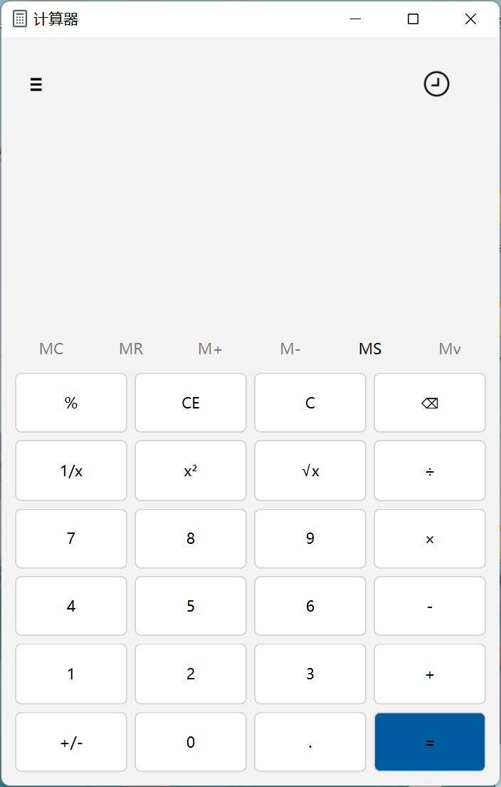
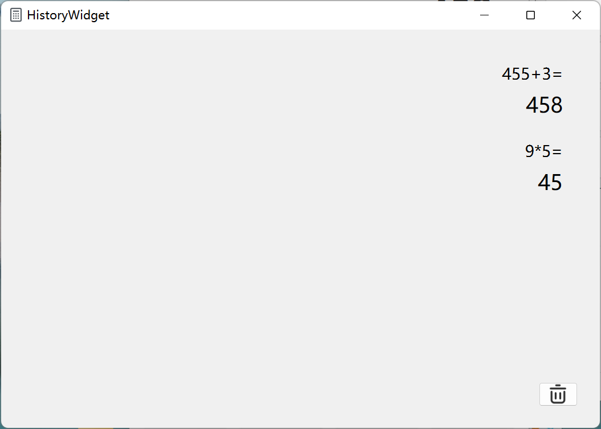
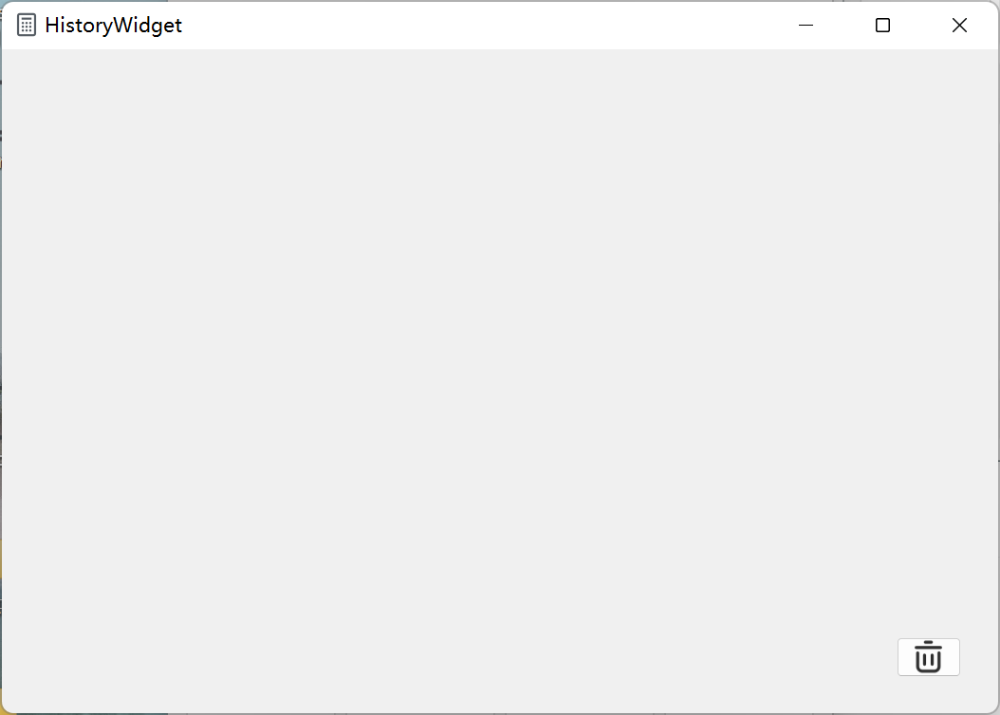
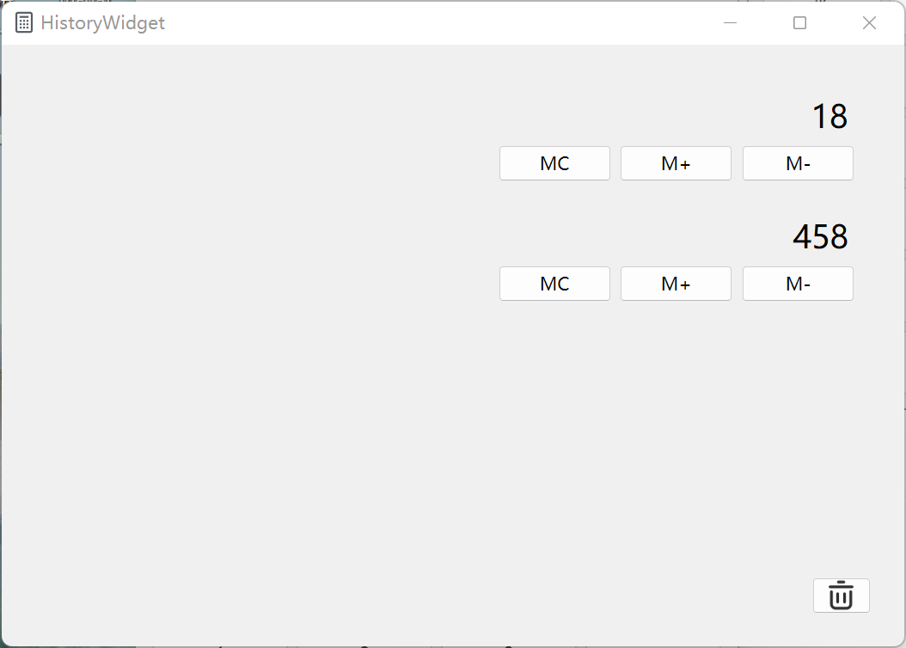

# 计算器界面说明

## 主界面



## 计算历史记录





## 内存历史记录




## 当前目录结构

```bash
.
├── README.md
├── historyexpressionitem.ui
├── historymemoryitem.ui
├── historywidget.ui
├── mainwindow.qrc
├── mainwindow.ui
└── png
    ├── eval_history.png
    ├── eval_history_empty.png
    ├── mainwindow.png
    ├── memory_history.png
    └── memory_history_empty.png

2 directories, 11 files
```

